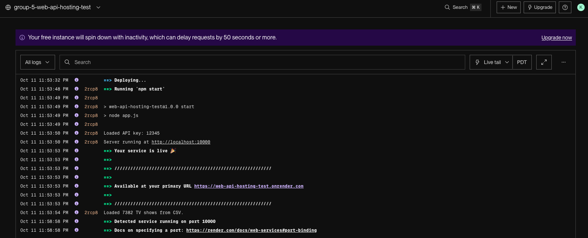
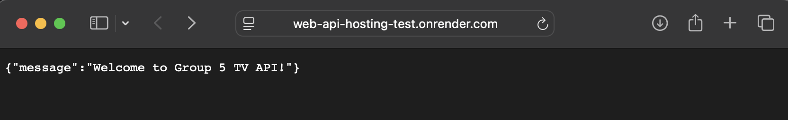
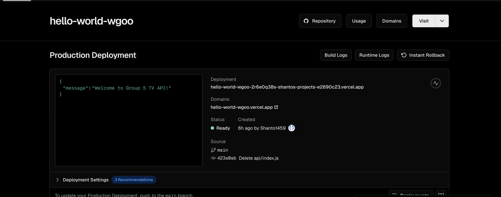
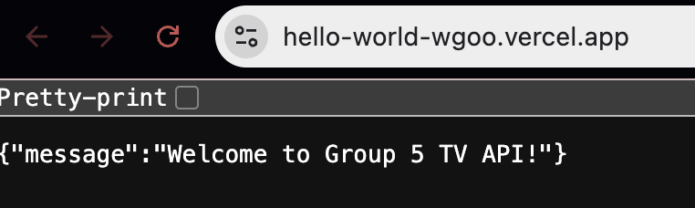

# Cloud Hosting Options for Node.js/Express Web APIs

This document explores free hosting options for Node.js/Express applications with PostgreSQL database support, tailored to the requirements of our backend project.

## Option 1: Render

**Website:** https://render.com

### Overview
Render is a modern cloud platform that provides free hosting for web services, static sites, and PostgreSQL databases. It offers automatic deployments from Git repositories and built-in SSL certificates.

### Pros
- **Easy Setup**: Simple deployment process directly from GitHub repositories
- **Automatic Deployments**: Automatically deploys when you push to your Git repository
- **Free PostgreSQL Database**: Includes a free PostgreSQL database tier (90 days, then expires)
- **Zero Configuration SSL**: Automatic HTTPS certificates for all deployments
- **Good Documentation**: Clear and comprehensive documentation for beginners
- **Custom Domains**: Support for custom domain names on the free tier
- **Build & Deploy Logs**: Detailed logs to troubleshoot deployment issues
- **No Credit Card Required**: Can start using the free tier without payment information

### Cons
- **Cold Starts**: Free tier services spin down after 15 minutes of inactivity, resulting in slow initial response times (30+ seconds)
- **Limited Resources**: Free tier has 512 MB RAM and shared CPU
- **Build Time Limits**: Limited build minutes per month on free tier
- **Database Limitations**: Free PostgreSQL database expires after 90 days and has storage limits
- **Performance**: Slower performance compared to paid tiers due to resource constraints
- **Monthly Restarts**: Services may restart periodically for maintenance

### Demo Test
- Below are the logs from a successful deployment test of a sample web-api we created for Render.

- Upon visiting the root endpoint, the API returns the expected JSON response: {"message":"Welcome to Group 5 TV API!"}

## Option 2: Vercel

**Website:** [https://vercel.com](https://vercel.com)

### Overview
Vercel is a powerful cloud platform designed for deploying web applications with a strong focus on frontend and serverless functions. It supports **Node.js/Express APIs** through its serverless architecture and integrates seamlessly with **GitHub**, enabling automatic deployments with every commit. Vercel is known for its simplicity, speed, and developer-friendly experience.

### Pros
- **Fast Deployment** – Easily deploy directly from GitHub in seconds with minimal configuration.  
- **Automatic Builds & Deployments** – Every Git push triggers an automatic build and deployment.  
- **Free SSL Certificates** – Provides HTTPS by default on all deployments.  
- **Custom Domains** – Free custom domain support with automatic SSL setup.  
- **Scalable Infrastructure** – Uses a global CDN and edge network for fast response times.  
- **Serverless Functions Support** – Ideal for lightweight APIs like our *Hello World* example.  
- **No Credit Card Required** – Fully usable on the free plan without payment details.  
- **Excellent Documentation** – Clear examples and guides for Node.js and Express setups.  

### Cons
- **Cold Starts** – Serverless functions can have a short delay when not used for a while.  
- **Execution Time Limit** – Serverless functions are limited to about 10 seconds on the free tier.  
- **Limited File System Access** – Cannot use persistent file storage between executions.  
- **Database Connections** – Requires external PostgreSQL hosting (no built-in database).  
- **Smaller Free Tier Limits** – Restricted to 100 deployments/month and 100 GB bandwidth on the free plan.  
- **Logs Retention** – Limited access to past logs in the free plan.  

### Demo Test
We deployed our **Hello World API** using Vercel’s serverless function setup.
- Below are the logs from a successful deployment test of a sample web-api we created for Vercel.

- Upon visiting the root endpoint, the API returns the expected JSON response: {"message":"Welcome to Group 5 TV API!"}

